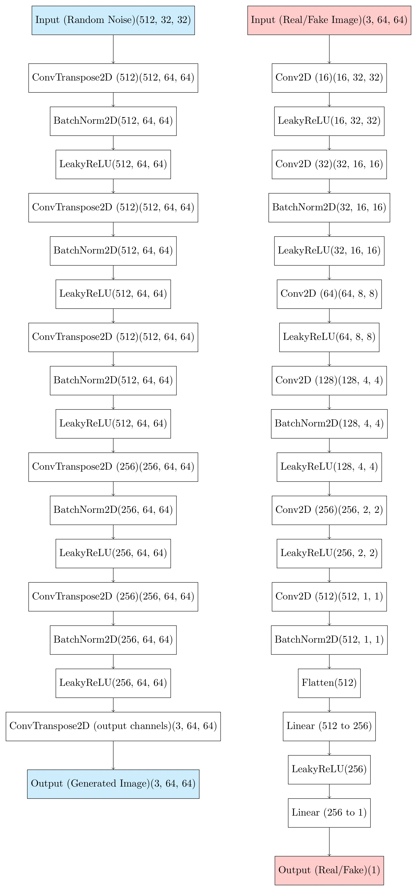

# Generative Adversarial Network (GAN) with PyTorch

This project implements a Generative Adversarial Network (GAN) using PyTorch. The architecture consists of two primary components:
- A **Generator** that creates images from random noise.
- A **Discriminator** that classifies images as real or fake.

## Architecture Overview


### Generator
The **Generator** takes in random noise (latent vector) and applies a series of transpose convolutions, batch normalization, and activation functions to generate realistic images.

- Input: Random noise of shape `(512, 32, 32)`
- Output: Generated image of shape `(3, 64, 64)`

**Key Layers:**
- `ConvTranspose2D`: Upsamples the feature maps.
- `BatchNorm2D`: Normalizes activations to help stabilize training.
- `LeakyReLU`: Adds non-linearity.

### Discriminator
The **Discriminator** classifies whether an input image is real or generated by the generator. It applies convolutions, batch normalization, and leaky ReLU to downsample and process the image.

- Input: Image of shape `(3, 64, 64)`
- Output: Scalar value indicating real or fake `(1)`.

**Key Layers:**
- `Conv2D`: Downsamples the image through learned filters.
- `BatchNorm2D`: Helps the network learn more effectively by normalizing intermediate values.
- `LeakyReLU`: Non-linear activation that allows for small negative values.

## Installation

1. Clone this repository:
   ```bash
   git clone https://github.com/sanepunk/GANs.git
   cd GANs
